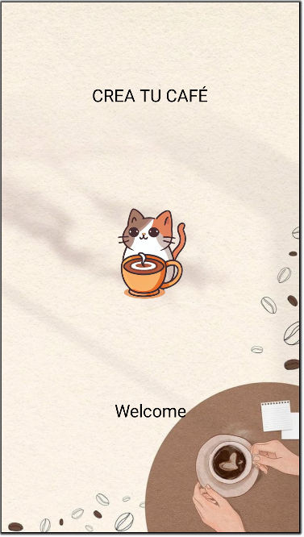
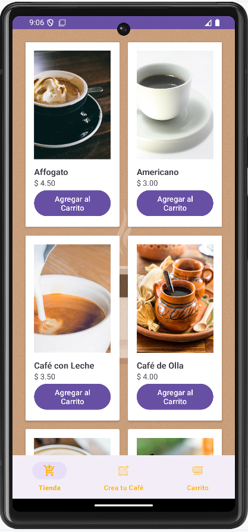
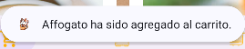
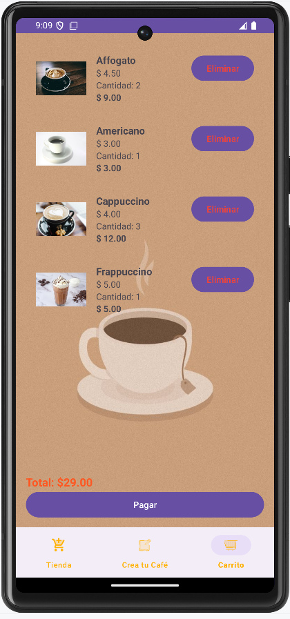
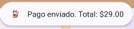
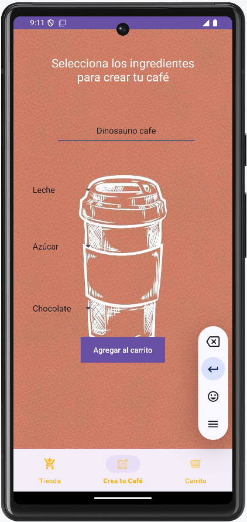
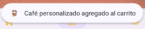
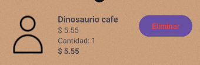
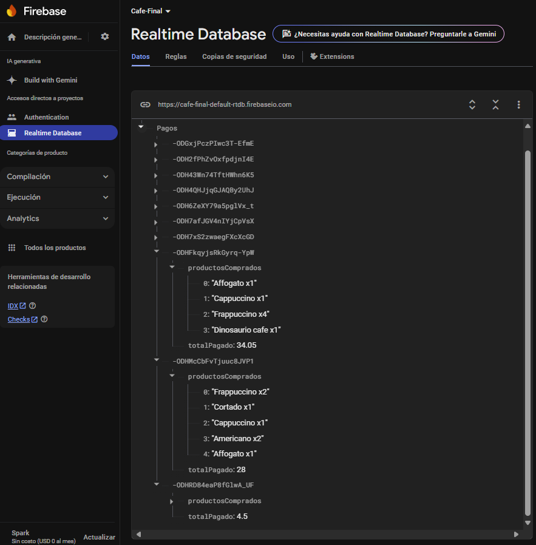
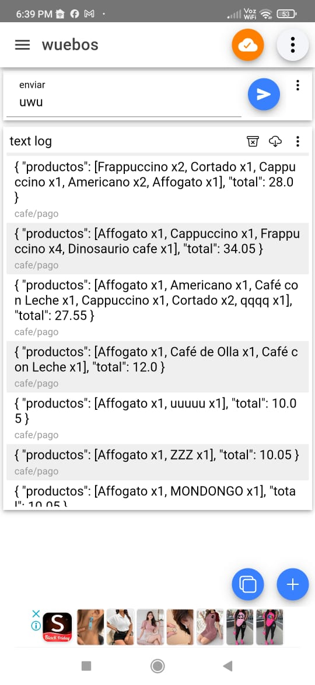

# Proyecto Final Aplicacion Android

Funcionamiento: El proyecto consiste en una aplicación donde se puede crear un café personalizado, ademas de tener la opción de comprar café pre hechos,
además cada vez que se le da click al boton de agregar al carrito se crea una lista de productos donde se puede ver su cantidad, precio x unidad, y un total

<h1 style="color: red;">Evidencia de los layout sobre la funcionalidad de la Aplicación android.</h1>

<h1 align="center"> splash layout </h1>

<h1 align="center"> Menu tienda</h1>

Este es el menu de mi aplicación donde se encuentra una lista de productos y su opción para agregar al carrito.

<h1 align="center"> Confirmación. </h1>

Esta notificación se muestra cuando un producto se ingresa correctamente a mi carrito de compra. en caso contrario se notifica el error.

<h1 align="center"> Carrito compra. </h1>

El carrito de compra se visualiza de la siguente manera, donde se muestra los productos comprados y su respectiva imagen,cantidad,precio y
un total de compra.

<h1 align="center"> Confirmación y notificación </h1>

Aqui se notifica que la compra se realizo exitosamente, en caso contrario se notifica el error.

<h1 align="center"> Crear café. </h1>

Este Layout es donde el cliente puede crear su cafe con un nombre personalizado e ingredientes al gusto, seleccionandolos en un spinner,
además de poder agregarlo al carrito respectivamente.

<h1 align="center"> Confirmación y confirmación. </h1>

Se notifica que el cafe personalizado se agrego exitosamente al carrito de compra.

<h1 align="center"> Producto personalizado en el carrito </h1>

Asi se visualiza el Producto agregado.

<h1 align="center"> Datos recibidos en FireBase </h1>

Se puede ver en la pagina de Firebase Realtime database que los datos se envian correctamente, se muestra los productos comprados y su cantidad, además del precio total, esto se inserto en el boton de Pagar del carrito.

<h1 align="center"> Mqtt </h1>

Se puede ver en la aplicación IoT MQTT Panel donde accedi al topico correspondiente, que los datos se envian correctamente desde mi aplicación, donde de igual forma recibe y se muestra los productos comprados y su cantidad, además del precio total. 

